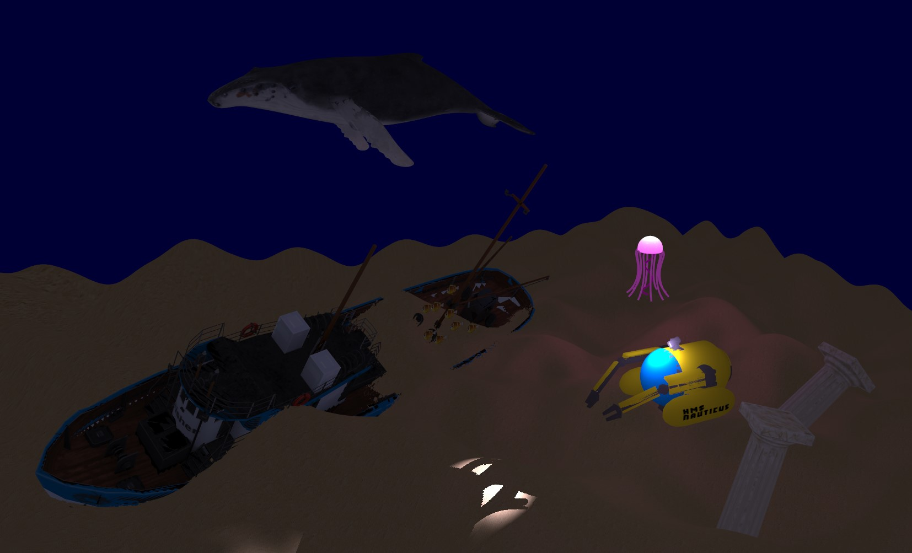
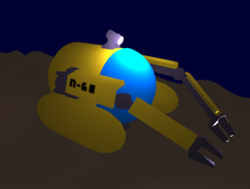

# Underwater OpenGL Scene

This repository contains code I have produced for my Computer Graphics Coursework at University. 
I would like to thank Professor Kristian Spoerer from the University of Nottingham for teaching me the subject.

The repo showcases what you can do in OpenGL and is written in C++. It's an underwater scene
with a controllable submarine model and other subaquatic entities such as a shipwreck, a whale, fish, etc...

## Submarine

The submarine is a 3D model I built in Blender. You can control its movement using the following keys:
- LEFT and RIGHT arrow keys to turn the sub.
- UP and DOWN arrow keys to move forwards or backwards, respectively.
- M and K to sink down or float upwards, respectively.
- I and J to turn the light up or down, respectively.
- L to toggle the light on or off.

## Skills demonstrated

### shaders

The shader used in this scene employs the 'Phong Lighting' model (more about it here: [https://en.wikipedia.org/wiki/Phong_reflection_model](https://en.wikipedia.org/wiki/Phong_reflection_model))

### shadows

### procedurally generated terrain

### writing an OBJ parser

Part of the coursework was to write an OBJ file parser. An obj file is a text file containing all of the vertices of a 3D model as well as its attributes: UV coords and the face normals. The obj parser function `parseObjFile()` and its auxiliary functions can be found it `./CW3/header/objparser.h`. The function goes through the following steps:
1. The function first separates out attributes (vertices, UV coords, face normals) into their own vectors. This is done via `sepAttrFromObjContent()`.
2. After separation, the attributes are then arranged into their appropriate positions in a new vector according to the `f` command of the obj file, which is done via `assembleTriangles()`. The new vector is to be passed to OpenGL for rendering.

More information about how obj files are supposed to be read can be found here: [https://www.cs.cmu.edu/~mbz/personal/graphics/obj.html](https://www.cs.cmu.edu/~mbz/personal/graphics/obj.html)

## Running the software

## Assets used

- Fish model by **printable_models**: [https://free3d.com/3d-model/fish-v1--996288.html](https://free3d.com/3d-model/fish-v1--996288.html)
- Whale model by **printable_models**: [https://free3d.com/3d-model/whale-v4--501429.html](https://free3d.com/3d-model/whale-v4--501429.html)
- Ship model by **HuNtEr_3DdD**: [https://www.turbosquid.com/3d-models/boat-pbr-model-1522670](https://www.turbosquid.com/3d-models/boat-pbr-model-1522670)
- Greek Column model by **emelyarules**: [https://www.cgtrader.com/free-3d-models/architectural/other/column-1600](https://www.cgtrader.com/free-3d-models/architectural/other/column-1600)
- Sand Texture by **hhh316**: [https://www.deviantart.com/hhh316/art/Seamless-beach-sand-texture-269309044](https://www.deviantart.com/hhh316/art/Seamless-beach-sand-texture-269309044)